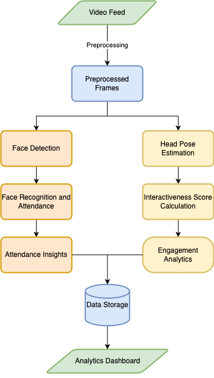

# Personal Documentation and Planner

## Flow of Data


## Directory Structure Plan
```
ClassInsights/
├── src/
│   ├── video_processing/
│   │   ├── frame_processing.py
│   │   └── ...
│   ├── facial_recognition/
│   │   ├── __init__.py
│   │   ├── face_detection.py
│   │   ├── face_recognition.py
│   │   ├── attendance.py
│   │   └── ...
│   ├── engagement_monitoring/
│   │   ├── __init__.py
│   │   ├── perclos.py
│   │   ├── head_pose_estimation.py
│   │   └── ...
│   ├── database/
│   │   ├── __init__.py
│   │   ├── student_profiles.py
│   │   ├── attendance_records.py
│   │   ├── engagement_data.py
│   │   └── ...
│   ├── dashboard/
│   │   └── ...
│   └── utils/
│       ├── __init__.py
│       ├── helpers.py
│       └── ...
├── tests/
│   ├── test_video_processing.py
│   ├── test_facial_recognition.py
│   ├── test_engagement_monitoring.py
│   ├── test_database.py
│   └── ...
├── docs/
│   ├── reference_docs/
│   │   └── ...
│   ├── README.md
│   ├── documentation.md
│   ├── project_proposal.md
│   ├── report.md
│   └── ...
├── requirements.txt
└── main.py
```